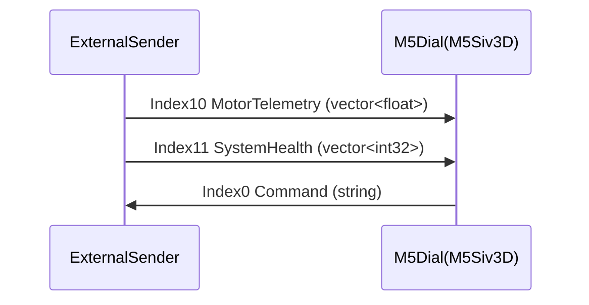

# Comms Protocol (MsgPacketizer)

このドキュメントは `src/CommsManager.hpp` が想定する **MsgPacketizerのインデックス** と **ペイロード仕様** を固定化します。

## Transport

- UART: `Serial2`（ボーレートやピンは `CommsManager::init()` で指定）
- フレーミング/シリアライズ: `hideakitai/MsgPacketizer`

## Index 定義（M5側）

| Index | 方向 | 用途 | 型（MsgPacketizerのsubscribe/send型） |
|---:|---|---|---|
| 0 | M5 → 外部 | コマンド送信 | 文字列（C文字列） |
| 10 | 外部 → M5 | モータテレメトリ | `std::vector<float>` |
| 11 | 外部 → M5 | システム健康状態 | `std::vector<int32_t>` |

> 送信側（Teensy等）も **Index と型** をこの表に合わせてください。

## Motor Telemetry（Index 10）

ペイロードは `std::vector<float>` として受信し、**1モータあたり4要素** を並べた配列です。

```
[ angleRad, torqueFlag, errorStatus, shutdownStatus,  angleRad, torqueFlag, ... ]
```

### フィールド

- `angleRad`:
  - 単位: ラジアン（`src/main.cpp` 側で度に変換して表示）
  - **センチネル**: `angleRad <= -900.0f` は「未更新/無効」扱い（UI上 `updated=false`）
- `torqueFlag`:
  - `> 0.5f` なら `isTorqueEnabled=true`
- `errorStatus`, `shutdownStatus`:
  - `>= 0.0f` の場合のみ `uint8_t` にキャストして状態更新
  - `-1.0f` など負値で「不明/未送信」を表現可能

### 要素数

`valuesPerMotor=4` として `packedData.size()/4` をモータ数として扱います。
モータ数が M5 側の `m_state.motors.size()` より多い場合は切り詰めます。

## System Health（Index 11）

ペイロードは `std::vector<int32_t>` として受信します。

最低長:

- `size >= 7` が必須（不足時はエラー扱い）

レイアウト（最低7要素の範囲）:

- `[0] crashLatch`（0=OK, 非0=クラッシュ/異常）
- `[1] persistentArmState`（例: 1=DISARMではない状態等）
- `[2..5] portFaults`（4ポート分）

拡張（`size >= 13` の場合）:

- `[7] engineRunning`
- `[8..12] groupModes[5]`
  - 0: OFF
  - 1: PLAY
  - 2: REC
  - 対象グループ順: Hip, Head, Eyelid, ArmL, ArmR

> NOTE: 現行実装では `[6]` は未使用です（送信側は0埋め推奨）。

## コマンド（Index 0）

M5側は文字列コマンドを送信します（例: `CLEAR_FAULTS`）。

`src/CommsManager.hpp` に初期登録されている主なコマンド例:

- `CLEAR_FAULTS`
- `CLEAR_CRASH_LATCH`
- `PLAY_START` / `REC_START` / `MOTION_STOP` / `MOTION_SAVE`
- `REC_SLOT:<n>`
- `LOAD_MOTION:<name>`
- `TORQUE_ON[:GROUP]` / `TORQUE_OFF[:GROUP]`
- `STIFFEN:<GROUP>`
- `REC_PRESET:<NAME>`

## タイムアウト/接続判定

`DiagnosticData::isConnected()` は以下のどちらかが **2秒以内** に更新されていれば接続中とみなします。

- telemetry: `lastTelemetryMs`
- health: `lastHealthMs`



